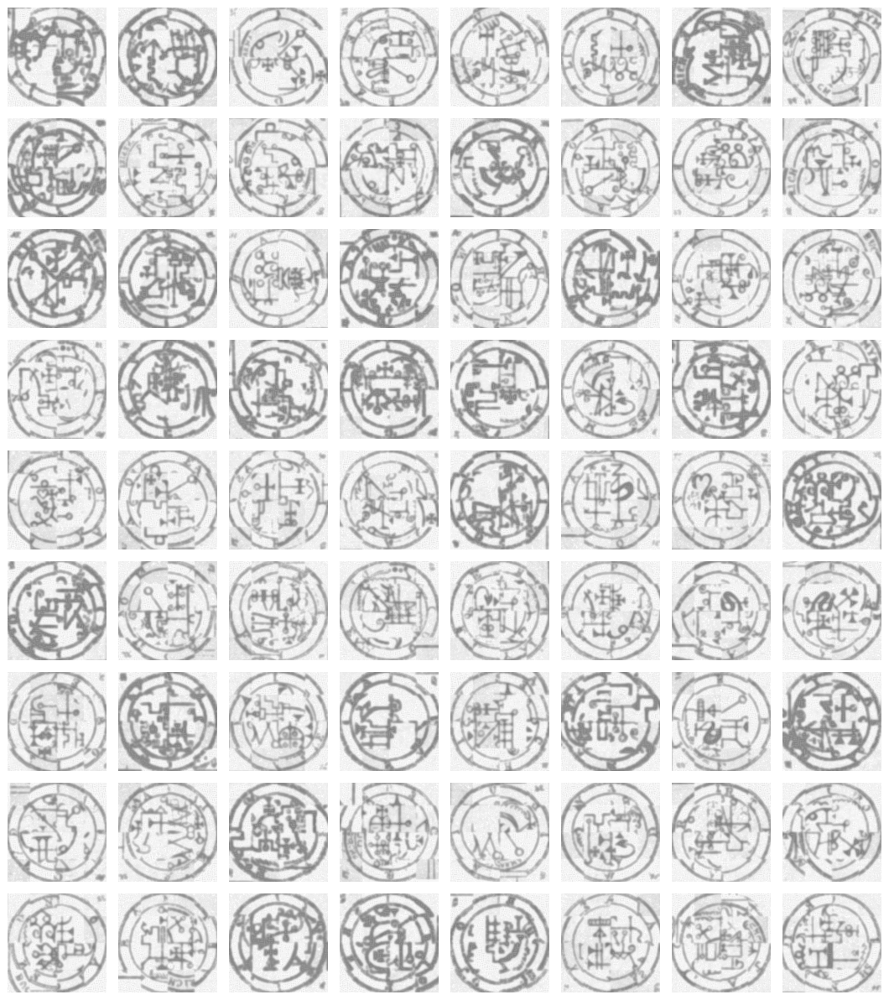

# NSRL — Deterministic Integer Transformer Research

NSRL is a pure-Rust integer-only training stack for deterministic CPU and WASM
models. The frozen `integer-transformer-proof-v1` result is a system-level
proof for a transformer plus fitted suffix memory. The active follow-up gate is
an architecture-level unassisted successor: a 16-cell suffix-free optimizer,
duration, balancing, attention, and position sweep produced no passing row. The
best transformer-only candidate still made 5,094 mistakes against the 2,510
gate, so the repository does not claim that the transformer itself beat
retrieval, byte n-gram, and the independently produced floating-point reference.

The first successor-v2 comparison is now fully executed under canonical integer
base-2 NLL. The physically stripped candidate (model
`0xeb39de58e94e0007`) scores 115,010,055 total millibits, worse than uniform
(47,168,000), retrieval (38,271,425), byte n-gram (38,025,720), and a genuine
trained float32 transformer (40,847,697). This is a frozen falsification: the
trial is valid, promotion is false, and paid scaling remains unauthorized.
Replay the bound matrix with
`node scripts/run-integer-transformer-successor-v2.mjs --check`.

Solomon multimodal generation and literary expert routing are experiment suites
that exercise the shared substrate. Their results inform candidate design, but
they do not replace the frozen proof contract in
[`docs/integer-transformer-proof-v1.md`](docs/integer-transformer-proof-v1.md).

Integer and quantized training, including transformer training, have substantial
prior art. NSRL's research claim is narrower: combine native-integer weights and
updates with exact replay, checked numeric health, and deployable Rust/WASM
artifacts, then measure which updates remain reachable under discrete optimizer
arithmetic. The evidence catalog and claim boundaries live in
[`research/README.md`](research/README.md) and
[`research/paper-catalog.md`](research/paper-catalog.md); reachable update
capacity is a testable hypothesis. A first 30-cell longitudinal result now
supports its use as a conservative preflight signal, not as a capacity law.

The matched post-freeze ablation is decisive: suffix memory accounts for all
of the combined candidate's top-1 gain, while transformer logits improve its
probability error without changing a prediction. See
[`docs/integer-transformer-proof-v1.md`](docs/integer-transformer-proof-v1.md)
for the exact boundary and replay command.

Two roadmap gates also completed locally. A contracted 2,048-window p10m
readiness run extended the stable K/V schedule against a matched float32 SGD
reference. Integer K, V, and output moved in every chunk with zero saturation,
the integer lane ended 5,209 total millibits below initialization, and the
float lane ended 98 mean millibits below its initialization. Midpoint replay
was byte-identical for the integer model and optimizer and tensor-identical for
all 13 float arrays. The follow-up isolated `gate`-projection preflight changed
only its shift from 25 to 23. `gate` first moved at window 768 and made 26 exact
updates over the full horizon; only K, V, `gate`, and output moved, saturation
remained zero, held-out ended 5,209 total millibits below initialization, and
midpoint replay was byte-identical. The follow-up `up` experiments separate
reachability from usefulness: shift 23 made 26 safe exact updates with no
source-relative dev gain, while shift 22 made 101,543 safe updates and still
failed discovery; its selected checkpoint tied dev and was 1,245 total
millibits worse on the one-shot test comparison. A matched-horizon functional
comparison localized the cause: shift-22 and shift-23 models produced identical
final features, logits, probabilities, and per-window losses on all 256 dev
windows. A forward-scale sweep found shift 7 safely exposes the difference in
250 feature/logit vectors and 124 probability vectors, but zero target
probabilities; fresh training at that scale remained safe, exact, and tied dev.
The target-resolution audit then showed exactly three source target-probability
values in Q15 and no changed targets, versus 20 values and one changed target
at Q19 and 115 values and 13 changed targets at Q23; Q23 matches Q31 target-
change coverage. Scale-compensated Q19 and Q23 gradient preflights remained
safe, but both produced the exact Q15 model bytes and dev loss after 256
windows while retaining distinct optimizer states. The normalization audit now
localizes the next bottleneck: the legacy Q31-LUT reciprocal produces about
98,900 ppm worst-case Q23 mass error, while retaining the reciprocal in Q47 and
applying one integer Newton step cuts that to 98/83 ppm for the source/candidate,
near exact division at 73/74 ppm. But target changes fall from 13 under the
legacy normalization to 5 under Newton and 4 under exact division. The frozen
accuracy gate therefore selected no training default. The completed per-window
attribution now resolves that ambiguity: Newton preserves all four exact-change
windows, while all nine legacy-only changes have unchanged target logits and
zero exact Q23 delta. Newton adds one denominator-rounding boundary window and
never differs from exact division by more than one Q23 unit anywhere in either
probability vector. The bounded normalized wide-gradient preflight is now
complete. Q23 plus `q47_newton1` is exactly replayable and changes the optimizer
state without changing the Q15-control model. Lowering only the `up` update
shift from 22 to 21 then materializes 155 `up` updates and changes 84 feature
and logit windows plus 29 probability windows, all with zero saturation, but no
target probability or dev loss changes. Lowering only the output update shift
from 34 to 33 recovers three changed target-probability windows, proving the
integer precision signal reaches the loss boundary, but regresses dev by 415
total millibits. The numeric bottleneck is therefore resolved without a quality
gain; the next local gate is a target-aligned integer-objective review rather
than more precision or paid scaling. Paid p20m remains unauthorized.
That objective-review infrastructure is now executable: production exposes
machine-checked forward/backward scale and accumulator contracts, a canonical
normalization-independent integer NLL evaluator, a faithful base-2 float
relaxation, and exact stored-parameter `-1`/`+1` gradient-alignment audits on
separate proposal and document-separated (or full-context-gap) transfer
surfaces with a deterministic random control. The
successor-v2 promotion contract requires a
transformer-only candidate and a real float-transformer baseline. These are
now exercised measurement tools, not a positive quality result. The first
matrix binds the dataset, exact target count, byte tokenizer, physically clean
candidate model, evaluator source set, runner, evidence, and all five replay
hashes. Candidate ablations prove that suffix-memory removal, retrieval
disablement, and routing-oracle disablement leave the same replay; the
candidate loses canonical NLL to every baseline. The rescue-stratified p10m v2
audit is complete over four proposal and four separate transfer documents. Its
primary rescue-exposed trunk proposal agreed on only `1/3` comparable
coordinates versus paired random `3/3`, and produced zero exact descents versus
random one. Output-head coordinates remained aligned on both surfaces.
The frozen v3 causal replay removed all 222 nonzero rescues while holding the
source and v2 coordinates fixed. It changed each of the four exposed aggregate
magnitudes by one count, changed no signs, and left alignment/descent identical.
Global rescue removal is therefore not a repair. Optimizer refinement, paid
scaling, and a quality claim remain unauthorized. The subsequent exact
rank-two Boolean-jet audit found the trunk block harmful alone on both surfaces,
the head block improving on both, and a post-hoc transfer interaction that made
the joint block one Q20 unit better than the head alone. A frozen confirmation
on 64 unused transfer documents falsified that candidate: head-only won 11
non-tied document contrasts versus 7 for the joint move, 46 documents tied, and
the aggregate conditional effect reversed to `+6` Q20. Optimizer refinement and
paid scaling remain unauthorized. The next mathematical target is a
stability-aware proposal operator, not another adjustment to this move family.
The audit substrate now binds ordered move atoms, complete
model/tokenizer/stream manifest hashes, explicit Q15 or MJ-05 Q47 objective
specifications, document-level losses, vertex model/function hashes, and exact
Möbius reconstruction. Calibration cannot authorize optimization, boundary
atoms reject the family, and audit-only systematic fixed-mass
`K={2^15,2^16,2^18}` lanes plus matched-block control freezing are implemented
for the next prospectively declared candidate.
The complete proposal-only six-atom cube is also measured. Its Q32 field has
only 16 units of absolute mass above order three out of 409,784 nonconstant
units, and the cubic truncation selects the exact aggregate minimizer. That is
not a promotion result: Q20 retains a materially larger relative tail, exact
support has maximal induced width five under all 720 elimination orders, and
the 64 proposal documents contain only one source cluster. The all-atom
minimizer is the already-falsified trunk-plus-head contrast. An exact derived
Walsh analysis finds a cubic surrogate with zero aggregate and per-document
gap in both grids, making cross-source replication of that compressed structure
the next lead. The next proposal work therefore needs multiple source clusters
and a genuinely new move generator; optimizer changes and paid scaling remain
unauthorized.
The preregistered Ising follow-up has now evaluated documents 136--199 without
changing its three masks, router, or Holm family. Frozen masks `59` and `61`
beat baseline on 51/64 and 50/64 documents respectively, and the singleton-
probe router improved over global mask `47` on all 17 documents it rerouted.
The stronger parameter claims did not replicate: no pair coupling is stable,
the confirmation pairwise MAP is `46`, and the Gibbs magnetization mask changes
from `61` to `62` at the central temperature. The replicated mechanism is a
conditional exchange—use atom 4's Q32 singleton effect to decide when it should
replace atom 2 inside the shared base mask `43`. Because both surfaces contain
only one SimpleWiki source cluster, that confirmation remains within-source
document evidence. A later prospective M3 experiment freezes a distinct-author
English Project Gutenberg frame with 16 fitting, 39 calibration, and 16
untouched evaluation source panels. Its 95% source-level correction is `4,326`
Q32; coverage is `16/16`, firing is `5/16`, and marginal unsafe-action rate is
`0/16`. Signed regret relative to always abstaining is `-40,769` Q32 in
aggregate (`-40,769/16` Q32 per evaluation panel), with zero positive regret.
The checked publication verdict is `supported`; the same publication protocol
maps preregistered falsifiers to `falsified` and a gray-zone or vacuous envelope
to `inconclusive`. This supports the conditional-exchange certificate on that
frozen frame, not arbitrary-source deployment. No optimizer change or paid
scaling is authorized, and documents `200--212` remain sealed.
M4 tests the same exchange on 104 whole-publication panels drawn equally from
Federal Register documents, new Gutenberg books, RFCs, and open-access science.
It samples four nonoverlapping passages per source and calibrates separately on
19 sources per family. The checked overall verdict is
`coverage_inconclusive_no_promotion`: 14/16 source panels are covered, because
two Gutenberg panels miss their envelope. The router still fires on 12/64
evaluation passages across three families, every fired contrast is favorable,
and net improvement is `63,541` Q32 with zero unsafe firing. Federal Register
and RFC pass their frozen local promotion rules, Gutenberg is withheld, and
science abstains. The broader certificate therefore remains unpromoted.
Separately, all 16 configurations with an early reachable
functional update later improved on a disjoint holdout; the
predeclared matrix measured MCC 0.645 and Spearman ρ 0.828. Six early no-ops
later woke up, so the screen has high precision but cannot safely prune
slow-to-activate candidates. Long low-rank runs also saturated in all 16
early-reachable cells, making saturation-aware control the next optimization
gate.

NSRL Forge packages that proof substrate as a model-launch recipe, measurable
sponsor bounty, capped model-local reward, and 31-event signed localnet run.
See [`docs/decentralized-model-launches.md`](docs/decentralized-model-launches.md)
for the protocol and [`docs/model-localnet-v1.md`](docs/model-localnet-v1.md) for
the Ed25519 ledger, CLI, validator quorum, and explicit non-financial boundary.



The current model family is:

- `NSRLTCH`: text-conditioned bitmap denoiser, i8 weights and u8 ink.
- `NSRLLAT1`: learned prompt-to-layout latent prior for text prompts.
- `NSRLMOD1`: discrete joint prompt/text/image-token model for coarse
  multimodal Solomon samples.
- `NSRLLMM1`: attention-based causal joint prompt/text/image-token model for
  native Solomon multimodal samples.
- `nsrl-core`: no-std integer kernels used by the trainer.

## Contract

Weights are i8 from initialization. Activations are Q15 i16. Large reductions
and gradient buffers accumulate in i64, then quantize back to i8 at batch
boundaries. The same arithmetic contract used for sampling is used during
training.

```text
source images + text signatures
  -> denoise dataset
  -> NSRLTCH text-conditioned denoiser
  -> NSRLLAT1 prompt/layout prior
  -> sampled bitmap seals
  -> held-out prior and generation eval
```

No float master weights, no post-training quantization, and no target-bitmap
lookup during generation.

## Workspace

```text
crates/
  nsrl-core/       no_std integer inference and numeric kernels
  nsrl-corpus/     corpus utilities retained for deterministic preprocessing
  nsrl-eval/       frozen proof contracts and comparison policy
  nsrl-train-core/ no_std training kernels shared by the host trainer
  nsrl-train/      Solomon training, eval, and sampling binaries
  nsrl-web-wasm/   wasm Solomon sampler parity surface
docs/
  solomon-seal-denoise.md      current pipeline contract and commands
  schemas.md                   active Solomon trace/artifact contracts
scripts/
  build-solomon-*.mjs          dataset, prompt, text-index builders
  run-solomon-*.sh|mjs         local eval/sample/sweep runners
  check-solomon-*.mjs|sh       pipeline honesty and replay gates
```

## Build And Check

```bash
cargo build --release -p nsrl-train \
  --bin nsrl-build-solomon-bitmap-denoise-dataset \
  --bin nsrl-bitmap-multichannel-denoise \
  --bin nsrl-bitmap-sample \
  --bin nsrl-solomon-latent-train \
  --bin nsrl-solomon-eval \
  --bin nsrl-solomon-multimodal \
  --bin nsrl-solomon-attention

./scripts/check.sh
```

## Agentic Research Harness

`scripts/research-harness.mjs` turns experiment proposals, frozen contracts,
allowlisted runners, independent checkers, and scientific decisions into one
hash-chained lifecycle. It enforces role separation and blocks execution when a
bound input or runner policy changes after freeze.

```bash
node scripts/research-harness.mjs init
node scripts/research-harness.mjs import-golden
node scripts/research-harness.mjs status
node scripts/research-harness.mjs verify
```

The first golden workflow imports the completed p10m Boolean-jet confirmation
and records its checked outcome as `falsified`. See
[`docs/agentic-research-harness.md`](docs/agentic-research-harness.md) for the
experiment schema, agent roles, lifecycle commands, runner-policy extension,
and the remaining OS-level data-firewall boundary.

## Pipeline

Build the bitmap denoise dataset:

```bash
node scripts/build-solomon-bitmap-denoise-dataset.mjs
```

Train the text-conditioned denoiser:

```bash
scripts/run-solomon-text-denoiser-train-local-docker.sh
```

Run the default AWS/Graviton pipeline:

```bash
NSRL_S3_URI=s3://BUCKET/PREFIX \
  scripts/aws/run-solomon-end-to-end.sh
```

Inspect the same resolved stage plan without running training:

```bash
bash scripts/check-solomon-aws-product-plan.sh
bash scripts/check-solomon-aws-launch-plan.sh
bash scripts/check-solomon-aws-prelaunch-readiness.sh
NSRL_AMI_ID=ami-... \
NSRL_S3_URI=s3://BUCKET/PREFIX \
NSRL_ARTIFACT_S3_URI=s3://BUCKET/PREFIX/artifacts/nsrl-working-tree.tar.gz \
  scripts/check-solomon-aws-live-launch-readiness.sh
scripts/aws/launch-solomon-product-run.sh --dry-run
```

Package the no-spend product proof into an operator handoff artifact:

```bash
node scripts/check-solomon-product-diagnostic.mjs --out /tmp/nsrl-solomon-product-diagnostic.json
node scripts/check-solomon-release-candidate.mjs \
  --diagnostic /tmp/nsrl-solomon-product-diagnostic.json \
  --out /tmp/nsrl-solomon-release-candidate.json
```

After a real run finishes, fetch and verify the completed artifact bundle:

```bash
scripts/aws/prove-solomon-product-run.sh \
  --s3-pipeline-uri s3://BUCKET/PREFIX/pipelines/RUN_NAME \
  --launch-dir data/aws-launches/RUN_NAME \
  --require-launch-dir
```

The default AWS run is the product path:
`dataset,denoiser,prior,generative-eval,attention-curriculum`, followed by the
final `promotion-bundle-check` gate. It trains the denoiser and latent prior,
evaluates held-out generation, then trains the v2 bidirectional attention
curriculum, writes a unified `quality-report.json`, and checks the promotion
manifest with `check-solomon-promotion-bundle.mjs`.
Successful runs also write `pipeline-complete.json`; the completed-run checker
requires that marker, every stage status file, EC2 Graviton IMDS provenance,
the durable S3 run metadata, the resolved v2/symbolic16 curriculum config,
map-reduce `auto-online-processors` worker evidence, agreement between
`run.env` and `pipeline-complete.json`, a passing promotion bundle, and synced
quality-report evidence that generated held-out rows and unique targets cover
all 72 spirits before treating the run as product evidence.
`fetch-solomon-product-run.sh` wraps the S3 sync and then runs the completed-run
artifact checker against the local bundle, writing `fetch-report.json` and
`aws-run-artifacts-check.json` beside the synced artifacts.
`prove-solomon-product-run.sh` is the preferred post-run wrapper: it invokes
the fetch/check path, then runs
`check-solomon-product-diagnostic.mjs --aws-run-dir ... --require-aws-run` and
writes `objective-coverage.json` and `release-proof.json` so operators have one
final JSON proof for the synced Graviton product run and the narrow Solomon
objective.
For release proof, pass `--require-launch-dir` with the executed launch
directory so the synced run is bound back to `dry_run=false`, the EC2
`instance_id`, the captured `launch-result.json` EC2 response, and the launch
manifest's post-run proof command.
`check-solomon-release-candidate.mjs` is the no-spend handoff wrapper before
that launch: it requires the full local product diagnostic, objective coverage,
Graviton CPU-scaling plan, launch plan, prelaunch readiness, ordered curriculum,
and per-direction quality ratchet, while allowing only the explicit missing
synced-run evidence gap.
`check-solomon-aws-live-launch-readiness.sh` is the no-spend operator check for
the current shell environment: it renders the real dry-run launch manifest with
the current `NSRL_AMI_ID`, S3, subnet/security-group, IAM, and run-name settings,
then runs the strict prelaunch readiness gate. It fails until a real AMI,
`NSRL_S3_URI`, and `NSRL_ARTIFACT_S3_URI` are supplied, so `--execute` has an
explicit ready/not-ready proof tied to the intended artifact and pipeline
prefix.
The launcher reruns that prelaunch gate in execute mode with
`--allow-execute-plan`, but execute mode first requires explicit `NSRL_S3_URI`
and `NSRL_ARTIFACT_S3_URI` values instead of launcher defaults. It writes
`prelaunch-readiness-check.json` and exits before `aws ec2 run-instances` if the
manifest is not ready.
The generated `launch.json` also records the exact
`post_run_proof_command` for the same S3 pipeline URI and launch directory, so
the completed-run proof can be invoked from the launch artifact without
reconstructing the handoff by hand. In execute mode, the launcher also writes
`launch-result.json`, records its SHA-256 in `launch.json`, and release proof
requires that response's `Instances[0].InstanceId`, AMI, instance type, and
requested subnet/security-group ids to match the executed launch manifest.
The EC2 launcher exports `NSRL_SOLOMON_REQUIRE_EC2_METADATA=1`, and the launch
preflight rejects plans that would boot without IMDS-backed instance provenance.
AWS attention stages default to `NSRL_SOLOMON_ATTENTION_BATCH_MODE=map-reduce`
and `NSRL_SOLOMON_ATTENTION_MAP_REDUCE_WORKERS=0` so workers auto-scale to the
visible Graviton CPU count; the product-plan preflight records and enforces
those settings, including `attention.cpu_scaling.policy`,
`processor_count`, and `effective_map_reduce_workers`. The wrapper also
defaults product attention runs to
`NSRL_SOLOMON_ATTENTION_CORPUS_VERSION=v2`,
`NSRL_SOLOMON_ATTENTION_TEXT_TOKEN_PROFILE=chunked`,
`NSRL_SOLOMON_ATTENTION_IMAGE_TOKEN_PROFILE=symbolic16`,
`NSRL_SOLOMON_ATTENTION_HELDOUT_PROMPTS=data/processed/key-solomon-goetia-latent-v1/prompts-expanded.jsonl`,
`NSRL_SOLOMON_GENERATIVE_EVAL_PROMPTS` set to the same held-out JSONL,
`NSRL_SOLOMON_GENERATIVE_EVAL_PERMILLE=200`,
`NSRL_SOLOMON_GENERATIVE_EVAL_LIMIT=72`,
`NSRL_SOLOMON_ATTENTION_SEQ_LEN=512`, and
`NSRL_SOLOMON_V2_REQUIRE_PROMOTED_SMALL_PROFILE=1`. Product AWS runs also pass
`NSRL_SOLOMON_V2_REQUIRE_ARCHITECTURE_PROFILE=1`,
`NSRL_SOLOMON_V2_MIN_D_MODEL=128`, `NSRL_SOLOMON_V2_MIN_HEADS=2`,
`NSRL_SOLOMON_V2_MIN_HIDDEN_DIM=256`,
`NSRL_SOLOMON_V2_MIN_TRANSFORMER_LAYERS=2`, and
`NSRL_SOLOMON_V2_MIN_CONTEXT_SEQ_LEN=384` into the final report. Generated
product evidence must cover the full held-out panel by default through
`NSRL_SOLOMON_V2_MIN_GENERATED_PROMPT_ROWS=72`. The AWS
`attention-curriculum` stage defaults to
`NSRL_SOLOMON_ATTENTION_V2_CURRICULUM_STAGES=identity,image,text-to-image,description-to-image,image-to-text,explain,hard-negative,native-bind`
so identity binding, image reconstruction/classification, prompt-to-image,
description-to-image,
image-to-text/image-to-explain/text-image-explain/image-to-attributes, source
explanation, and hard-negative passes happen before the final joint pass. The
last `native-bind` pass defaults to
`NSRL_SOLOMON_ATTENTION_V2_NATIVE_BIND_EPOCHS=2`, and the AWS product-plan and
completed-run gates require at least that much final binding pressure. Local
attention smokes stay serial and unstaged unless those env vars are set.
Native attention train traces now emit `tasks` and `task_phases` coverage from
the filtered `examples.jsonl`; the curriculum checker rejects a stage if the
Rust train trace task counts diverge from the manifest that selected the
stage's corpus slice.
V2 corpus builds also add explicit primary-name, alias, and seal-ID identity
binding rows, and the retrieval spine gate requires each binding as both
`identify` and `text-to-image` evidence.
The product-plan preflight resolves that held-out prompt JSONL, records its
FNV64 byte hash, counts valid prompt rows, and verifies the generative eval
stage uses the same file with an eval split broad enough for all 72 spirits and
a 72-prompt limit before approving the Graviton run.

Train and evaluate the prompt-to-layout prior, then sample a fixed prompt panel:

```bash
scripts/run-solomon-prior-smoke-local-docker.sh

NSRL_SOLOMON_LATENT_MODEL=data/local-runs-linux/local-solomon-prior-smoke/latent/model.nsrllat \
  scripts/run-solomon-coherence-panel.sh
```

Run held-out generative eval:

```bash
node scripts/run-solomon-generative-eval.mjs \
  --latent-model current=data/local-runs-linux/local-solomon-prior-smoke/latent/model.nsrllat
```

Build the first joint text/image model:

```bash
scripts/run-solomon-multimodal-smoke.sh
```

This trains `NSRLMOD1` from a single serialized stream:
`<BOS> <PROMPT> ... <TEXT> ... <IMAGE> ... <EOS>`. The image side is a coarse
16x16 token plan, not the high-resolution denoiser.

Build the attention-based joint model:

```bash
scripts/run-solomon-attention-smoke.sh
```

This trains `NSRLLMM1`, a native causal mini-transformer wrapper using
base-2 softmax attention and learned absolute positions over the same joint
byte-token stream. The current integer core is widened to the promoted Solomon
width (`d_model=128`, two heads, hidden dim 256) and writes a two-block stacked
forward trunk. Lower stacked blocks initialize as no-op residual blocks, and
the serial and map-reduce host trainers backpropagate through stacked blocks
with conservative lower-layer warm-up. The smoke samples with
prompt-conditioned corpus decoding from `examples.jsonl`, and gates the output
text plus 256-token image plans so coherent known-prompt samples stay checked.

Set `NSRL_SOLOMON_ATTENTION_CORPUS_VERSION=v2` to build the task-marked
bidirectional corpus. It adds identify, text-to-image, image-to-text,
image-to-explain, text-image-explain, image-to-attributes, explain,
description-to-image, and hard-negative match records for both wrong-seal and
wrong-prompt/name mismatches; attention eval reports metrics by task. V2 task
records normalize non-identifying generic prompts to identity-bearing prompts
such as `seal of Bael`, so supervised retrieval never maps the same prompt to
multiple spirits. V2 defaults to `--image-token-profile symbolic16`, which adds
ink, edge, component/topology, radial-position, and stroke-direction channels
while keeping the same 16-bin byte image vocabulary. Set
`NSRL_SOLOMON_ATTENTION_IMAGE_TOKEN_PROFILE=ink-edge16` for the older two-channel
profile during experiments; normal v2 smoke gates require `symbolic16` via
`NSRL_SOLOMON_V2_REQUIRE_IMAGE_TOKEN_PROFILE` and
`NSRL_SOLOMON_V2_REQUIRE_IMAGE_TOKEN_CHANNELS`. They also default
`NSRL_SOLOMON_V2_REQUIRE_IMAGE_CHANNEL_TOKEN_STATS=1`, so `manifest.json` must
prove each required channel is active and multi-bin across the 72 source seal
signatures. V2 smoke runs also gate the
retrieval spine: known prompts, held-out prompt rows when available,
text-to-image and description-to-image image-plan rows,
image-to-text/image-to-explain/text-image-explain/image-to-attributes reverse
image rows, positive match rows, wrong-seal negative rows, and wrong-prompt/name
negative rows must all bind to the intended spirit pair. `image-to-text` rows
also carry source provenance metadata even though their supervised target is
just the primary name; source prose is trained through explanation and attribute
tasks.
Source-bound rows also carry `source_query_kind`, and the corpus/objective
contracts require the expected query kind for each source direction. V2
runners default to
`NSRL_SOLOMON_V2_REQUIRE_HELDOUT_PROMPTS=1` and
`NSRL_SOLOMON_V2_MIN_HELDOUT_PROMPT_ROWS=72`, using
`NSRL_SOLOMON_ATTENTION_HELDOUT_PROMPTS` or the checked-in expanded prompt
corpus, so missing held-out paraphrases fail instead of silently downgrading the
gate. Promotion repeats those retrieval-spine checks against
`retrieval_head_eval` itself, including all identity-binding kinds, image-task
rows, and both hard-negative roles. The same v2 path writes
`retrieval-head.json`, a sparse integer auxiliary text/image class head for
identity confidence before generation, then checks generated known-prompt sample
images by signature rank and retrieval-head image-to-text identity. The generated
sample gate also requires the model's generated text to retrieve the expected
spirit and agree with the generated image, then writes a compact confidence
trace with rank margins, generated image identity, generated text identity, and
text/image agreement flags. V2 smoke runs also write
`identity-inference.json`, a reusable
text/seal/sample report that ranks prompts, generated text, and 16x16 seal
plans against the same 72-way integer retrieval head and requires source-text
evidence for inferred prompt, generated-text, image, and signature candidates.
The final report checks that identity
inference source-text evidence uses the promoted manifest `source_text_index`
by path and byte hash. V2 smokes also write `grounded-corpus.json`,
which verifies source/explanation rows and image-to-attributes rows overlap the
source index across all 72 spirits before training evidence is trusted. The
final report ties that sidecar back to the promoted `examples.jsonl` path and
hash, and to the same manifest `source_text_index` hash, so stale
grounded-source evidence from another corpus or source index cannot satisfy the
gate. Promotion repeats the raw grounded-corpus task checks, including
source-overlap floors, per-task 72-spirit coverage, source-provenance rows, and
zero tolerated source-placeholder or generic-rank fallback rows.
Attention sample smokes also write
`generation-integrity.json`,
which rejects target-pixel/oracle guidance sources and display-time cleanup
fields in the generation traces. V2 runs finish with `quality-report.json`,
which joins task eval, retrieval-head eval, sample binding, identity inference,
grounded corpus evidence, generation integrity, and a cross-modal
`confidence_trace` into one ratchetable scoreboard. The confidence trace keeps
native forward image-plan metrics for `text-to-image` and `description-to-image`
separate from reverse image-to-text retrieval, and requires generated text/image
agreement plus generated text/source evidence, so both directions stay visible.
Identity inference also carries prompt and generated-text retrieval margins in
the source-grounding trace, so text/image agreement must be confident, not just
top-1 consistent.
Promotion checks also require all four named product directional groups:
text prompt to image plan, seal image to text, text plus seal to explanation,
and identity/source binding.
It also carries a
`corpus_contract` section from `manifest.json` and `examples.jsonl`, so promoted
reports prove the v2 `symbolic16` image profile and required ink/edge/component/
radial/direction channels directly, including deterministic per-channel token
stats from the source signatures, 72 unique per-channel source payload hashes,
all required task buckets and hard-negative roles across the 72 spirits, and
serialized task-marker/token-hash integrity from the corpus token file.
Promotion repeats those raw corpus-contract checks, including channel stats,
task-marker integrity, modality integrity, and image-channel marker payload
evidence. It also checks
`retrieval_head_eval.corpus_provenance`, so the auxiliary retrieval head must
have been evaluated against the same `examples.jsonl` and corpus token file
being promoted; newer retrieval evals also carry byte hashes for those files.
`check-solomon-v2-retrieval-head-provenance.mjs` exposes the same head/corpus
binding as a small standalone gate for local or CI runs before the full quality
report exists.
When held-out prompts are required or evaluated, the report also verifies the
retrieval eval's prompt JSONL path, `prompts_hash`, and valid prompt-row count so
stale or tiny paraphrase files cannot satisfy the held-out generalization gate.
Generated sample binding, identity inference, and denoise bridge traces also
record retrieval-head model hashes when available, and the quality report rejects
any recorded downstream hash that differs from the retrieval-head eval hash.
The confidence trace summarizes known/held-out prompt binding,
identity-binding retrieval by primary name, primary seal, alias, alias seal, and
seal ID, per-task forward/reverse image binding, image-to-attributes binding,
match yes/no agreement, wrong-image and wrong-prompt hard negatives, symbolic
image-token byte evidence, source-text grounding, grounded source/attribute
corpus evidence, staged identity-binding preservation, and optional
denoise bridge evidence. The
report also records the
`NSRLLMM1` architecture profile (`d_model`, heads, hidden size, layer count,
context length), measured output-head stats/ranges for special, text, and image
tokens, and the auxiliary retrieval class head so larger runs can ratchet toward
the target small-model profile instead of silently passing with a weaker shape.
The quality report
loads `retrieval-head.json`, verifies its schema/model hash, and requires both
text and image heads before class-head readiness can go true. The promotion
bundle checker repeats the class-head evidence checks, including the 72-label
coverage, text/image head validity, nonzero weights, and verified model-hash
link to the retrieval eval. Promotion-grade runs can also set
`NSRL_SOLOMON_V2_REQUIRE_IDENTITY_INFERENCE=1`,
`NSRL_SOLOMON_V2_REQUIRE_CURRICULUM_STAGES=1`, and
`NSRL_SOLOMON_V2_REQUIRE_DENOISE_BRIDGE=1` so missing product-path evidence
fails the quality report instead of only leaving a `*_ready` flag false.
`NSRL_SOLOMON_V2_REQUIRE_CONFIDENCE_TRACE=1` is enabled by default in v2
smokes and makes the cross-modal confidence trace a hard gate. Set
`NSRL_SOLOMON_ATTENTION_DENOISER_MODEL` to also run the generated 16x16 image
plan through the 128x128 denoiser; that optional bridge writes
`denoise-bridge.json`, checks the 128x128 output downsampled back against the
plan with non-flat ink range, classifies the downsampled output through the v2
retrieval head when available, rejects denoiser traces with target-pixel,
oracle, guidance, or display-cleanup side channels, requires the bridge
`attention_plan` and expected identity to match a generated plan recorded in
`sample-binding.json`, and records the FNV64 hash of the denoiser model named by
each sampler `trace.model`. The final quality report recomputes that model hash
and each bridge output's plan distance, ink range, and retrieval identity from
the raw denoiser bytes before it sets `denoise_bridge_ready` in the quality
report. The AWS end-to-end runner
automatically uses the pipeline denoiser as
`NSRL_SOLOMON_ATTENTION_DENOISER_MODEL` when the `denoiser` stage or an
explicit `NSRL_SOLOMON_DENOISE_MODEL` is present; set
`NSRL_SOLOMON_ATTENTION_DENOISER_MODEL=none` to skip that bridge for a targeted
rerun. Set `NSRL_SOLOMON_ATTENTION_DENOISE_MAX_OUTPUT_SIGNATURE_DISTANCE` to
turn that measured plan/output distance into a hard ratchet, and
`NSRL_SOLOMON_ATTENTION_DENOISE_MIN_OUTPUT_INK_RANGE` to raise the non-flat
output floor. Product runs with a required denoise bridge also default
`NSRL_SOLOMON_V2_REQUIRE_DENOISE_OUTPUT_IDENTITY=1`, so the downsampled 128x128
endpoint must identify as the expected spirit through the retrieval image head
with a positive margin. The denoise bridge recomputes the supplied retrieval
head's `model_hash` and rejects stale or forged scorer JSON before that output
identity can count. It also records `expected_spirit_ids`,
`unique_expected_spirit_ids`, and `expected_unique_targets`; product Graviton
plans currently require at least two distinct denoise bridge targets through
`NSRL_SOLOMON_ATTENTION_DENOISE_MIN_UNIQUE_TARGETS=2`, with the intended ratchet
toward all 72 Solomon targets as coverage expands.
For curriculum experiments, set
`NSRL_SOLOMON_ATTENTION_V2_CURRICULUM_STAGES=identity,image,text-to-image,description-to-image,image-to-text,explain,hard-negative,native-bind`
to derive stage-specific corpora from the same v2 stream using
`scripts/filter-solomon-multimodal-corpus.mjs`; accepted stage names are
`identity`, `image`, `text-to-image`, `description-to-image`, `image-to-text`,
`explain`, `match`, `hard-negative`, `native-bind`, and `all`. Staged runs write
`curriculum-stages.json`, which
checks each filtered corpus, train trace, stage order, filter recipe, and
identity-binding hash coverage before feeding the result into the v2 quality
report. It checks each filtered example's task marker and row token hash against
the stage token file, verifies that filtered stages preserve each task's
modality order, and proves the required symbolic image-channel marker bytes plus
256-token image-bin payloads for image-bearing examples. The stage checker also writes
`source_corpus_provenance`, and the final
quality report requires those source examples/token paths and byte hashes to
match the promoted corpus inputs. Filtered stage manifests also carry
`task_coverage`, and the stage
checker emits `stage_evidence`; the `image` stage must prove both
text/description-to-image plan rows and image-to-text classification rows across
all 72 spirits. Promotion-grade curriculum runs pass the same ordered stage list through
`--require-curriculum-stage-names`, so the final `quality-report.json` fails
`model_only_quality_floor.met` if a stage is omitted or reordered. The
`image-to-text` stage
includes both seal-to-name and seal-to-source-description records.

Model-only attention quality is measured separately:

```bash
cargo run -p nsrl-train --bin nsrl-solomon-attention -- eval \
  --model data/processed/key-solomon-goetia-attention-v1/model.nsrllmm \
  --tokens data/processed/key-solomon-goetia-attention-v1/corpus.tokens.u8 \
  --conditioning-examples data/processed/key-solomon-goetia-attention-v1/examples.jsonl
```

The evaluator reports constrained next-token top-1/top-5/top-10 accuracy, mean
target rank, target-vs-best logit margin, and Q15 probability error by prompt,
generated text, image, and special markers. Current free-running model-only
text remains weak; prompt-conditioned decoding is the quality-preserving path
for known Solomon prompts while the underlying attention trainer improves.
`nsrl-solomon-attention train` also exposes `--window-offset N` so raw-quality
experiments can cover different next-token residue classes when using a stride
greater than one. The Solomon attention runners default to `--stride 1` now so
capped runs cover all target phases instead of one modulo-stride class.
For raw continuation probes, use `sample --conditioning-examples none
--text-prior-examples none --no-embedded-text-memory`; add `--text-prefix
"Solomon selects "` to test whether the model can continue a generic scaffold
without prompt-conditioned replay or artifact text memory. Add
`--decode-logit-delta` for an experimental diagnostic that subtracts the
deterministic initial-model logits from candidate scores; this exposes learned
logit movement but is not yet the promoted quality path.
`--prompt-name-opening-prior` constrains only the short
`Solomon selects <prompt-name>: He` opening from a known spirit name in the
prompt for both char and chunked artifacts; it is useful for raw prompt-binding
probes and does not supply body prose.
`--text-chunk-boost-q8 N` can be used with chunked artifacts to test whether
whole-phrase/name chunk logits contain usable signal without embedded memory;
it is diagnostic, not a promoted decoder.
For an artifact-native text LM path, add `--embedded-text-lm-order 12
--text-prior-min-order 3 --text-prior-strict` with
`--no-embedded-text-memory`; this rebuilds prompt-scoped local transition
statistics from compact model memory and records
`text_prior_source:"embedded_lm"`. Named prompts scope the LM to exact-prompt
or primary-name matches; the generic `king solomon seal` prompt keeps the full
memory. The order-12 default is long enough to disambiguate repeated source
phrases such as Decarabia's two `of Birds` contexts. Strict prior matches are
applied before repeat filters and are not overridden by them.
The optional `chunked` text profile uses reserved byte tokens for high-frequency
Solomon phrases and all 72 normalized primary spirit names, which makes
prompt-to-name experiments less dependent on character-by-character spelling.
For narrow prompt-binding probes, build the corpus with
`--prompt-profile seal-names`; this keeps only `seal of <primary_name>` prompts
and removes generic and alias prompt noise.
`nsrl-solomon-attention train --solomon-name-copy-init` is an experimental
chunked-profile initializer that seeds a copy-style attention path for
`seal of <name>` prompts. It makes raw `Solomon selects <Name>: He` openings
prompt-bound before prose fine-tuning, and requires
`--text-token-profile chunked`. `--solomon-name-copy-repair` reapplies only
those copy/opening slots after a fine-tune, which is useful for checking whether
body-training gains survive without regressing prompt-bound openings.
When training body chunks on top of that scaffold, add
`--solomon-name-copy-repair-preserve-body-output` so the final repair does not
erase non-opening body-token output rows. `--target-segment body-first-after-he`
is a narrow curriculum target for only the token immediately after the `He `
opening; it is useful for diagnosing body-start logits separately from later
function-word frequency. `--target-segment body-first-after-opening` targets the
first token after `Solomon selects <Name>: `, so source openings such as `He `,
`This `, `His `, and `and ` can move toward argmax without forcing every spirit
through the same `He ` start.
`--solomon-body-scaffold` overlays a deterministic no-memory body transition
path after the prompt-bound `He ` opening. It provides a clean raw-attention
fallback sentence for every normalized primary name; source-specific body prose
still comes from the embedded text-memory/LM path. This static scaffold is only
supported on <=64d diagnostic builds; promoted-width runs should use
`--solomon-body-opening-repair` and the binding gates instead.
`--solomon-body-opening-repair` is an experimental chunked-profile repair that
uses embedded text memory to add a name-conditioned first-body-token attention
lane after `Solomon selects <Name>: `. It preserves scaffold-owned body tokens
with an additive signal, so `and`/`A` openings stay near argmax without
damaging the deterministic raw fallback.
The raw-quality checker reports character repetition, word repetition,
case-noise, and Solomon source-vocabulary metrics so repeated names, glued
repeated chunks, uppercase-heavy pseudo-words, out-of-corpus fragments, and
repeated `Solomon selects` restarts no longer score as readable prose. Pass
`--prompt "seal of Bael"` to penalize missing or wrong-spirit openings, and
pass `--no-vocab` only when probing a non-Solomon corpus.
The browser artifact path is checked separately with
`node scripts/check-solomon-attention-web-quality.mjs`; it loads the checked-in
`NSRLLMM1` artifact through the same JS sampler used by the app and verifies
known prompt-scoped text plus embedded image-memory output. Add
`--all-names --summary` to verify prompt-bound text and embedded seal output
across all 72 primary spirit prompts.
Use `node scripts/probe-solomon-attention-raw-rank.mjs --prompt "seal of Bael"`
to inspect the raw attention logits at the prompt-name boundary. The probe
reports the expected embedded-memory continuation token, its raw rank/margin,
and the top raw candidates after a prefix such as `Solomon selects `. Add
`--all-names --summary` to report top-1/top-5/top-10 and median rank across all
72 primary spirit prompts.
Use `node scripts/probe-solomon-attention-body-start-rank.mjs --summary` to
measure the source-specific first token after `Solomon selects <Name>: `. This
is the raw body-start diagnostic; the promoted artifact gates it with
`--min-top1 72 --min-top5 72 --min-top10 72` after stripping numeric bracket
footnote refs, so most cleaned source prose openings are raw argmax and every
opening remains in the near-candidate set.
Use `node scripts/check-solomon-attention-raw-scaffold.mjs --summary` to verify
the checked-in no-memory raw fallback sentence across all 72 normalized primary
spirit names.
Set `NSRL_SOLOMON_ATTENTION_CORPUS_VERSION=v2` to train against task-marked
bidirectional binding records. In v2 mode, the attention smoke gate also runs
`scripts/check-solomon-attention-task-eval.mjs` so identity, text-to-image,
image-to-text, image-to-explanation, text+image-to-explanation, explanation,
image-to-attributes, positive match, wrong-seal no-match, and
wrong-prompt/name no-match eval groups must stay present and cover all 72
spirits in `examples.jsonl`. It also checks `manifest.json` and v2 examples for
the required symbolic image profile/channels, verifies each example's
serialized token slice begins with the expected task marker token and matches
its recorded `token_hash`, verifies the task's modality order in the serialized
bytes (`PROMPT -> IMAGE`, `IMAGE -> TEXT`, `PROMPT -> IMAGE -> TEXT`, or
`IMAGE -> PROMPT -> TEXT` as appropriate), and proves image-bearing task slices
contain each required symbolic channel marker plus its 16x16 payload after
`IMAGE`. Product directional groups require the conditioning and output phases:
text-to-image must show prompt and image phases, image-to-text/attribute tasks
must show image and text phases, and text+seal explanation/match tasks must
show prompt, image, and text phases. `node scripts/check-solomon-attention-task-eval-self-test.mjs` builds
a tiny synthetic v2 fixture that exercises the same task-eval contract and
rejects missing conditioning/output directional phase evidence, weak per-direction top-k quality,
partial task coverage, corrupt task markers, invalid task modality order,
missing hard-negative role coverage, missing serialized image-channel markers,
weak symbolic channel stats, and inconsistent output-head target accounting.
When examples and token files are supplied, the checker also
requires the eval trace's recorded examples path, token path, token count, and
token hash to match those files, and the self-test rejects stale eval/corpus
provenance. The smoke then runs
`scripts/check-solomon-v2-grounded-corpus.mjs` so source/explanation and
attribute rows must overlap the source index across all spirits.

Run the current model-only text-quality curriculum gate:

```bash
scripts/run-solomon-attention-curriculum-smoke.sh
```

This pretrains the same `NSRLLMM1` transformer on prompt/text-only Solomon
sequences, wraps it against the joint prompt/text/image corpus, and gates the
bounded generated-text eval. The joint stage uses its own default update scale
(`NSRL_SOLOMON_ATTENTION_JOINT_LEARNING_RATE=2`, 512 joint windows, and
joint-specific LR-shift variables) so it accepts real prompt/text/image updates
without changing the text pretrain scale. It is a measured improvement path for
text and image logits, not a claim that pure free-running attention prose is
solved. The same smoke
embeds compact prompt/text/image memory in the `NSRLLMM1` artifact and gates a
model-native memory-assisted sample with `--conditioning-examples none`. The
embedded memory is prompt-aware for spirit prompts, so `seal of Bael` must
produce a Bael opening and Bael 16x16 image-token plan rather than any coherent
Solomon sentence or seal. This produces readable sentence-level text and a
prompt-scoped image plan without external text-prior flags. It also writes
`raw-sample-bael/` with
`--conditioning-examples none --text-prior-examples none
--no-embedded-text-memory --text-prefix "Solomon selects "` so attention-only
continuation quality stays visible. The smoke reports non-gating raw-quality
metrics from `scripts/check-solomon-attention-raw-quality.mjs` for this sample
so raw changes can be compared without relying only on eyeballing text. It also
writes `opening-sample-bael/` with
the same external and embedded priors disabled plus `--prompt-name-opening-prior`,
gating that named prompts bind to the correct `Solomon selects Bael: He`
opening before raw continuation resumes. For deeper local runs, tune
`NSRL_SOLOMON_ATTENTION_TEXT_TOKEN_PROFILE`, `NSRL_SOLOMON_ATTENTION_PROMPT_PROFILE`,
`NSRL_SOLOMON_ATTENTION_MAX_TEXT_CHARS`, and
`NSRL_SOLOMON_ATTENTION_JOINT_TEXT_ONLY_REPEATS`.
`NSRL_SOLOMON_ATTENTION_NAME_INITIAL_REPEATS` adds short sequences that train
only the first name token after `Solomon selects `, while
`NSRL_SOLOMON_ATTENTION_NAME_OPENING_REPEATS` adds short
`Solomon selects <name>: He ` sequences. The runners also expose
`NSRL_SOLOMON_ATTENTION_JOINT_TARGET_PHASE` (`all`, `special`, `text-char`,
`text-chunk`, or `image`) for stage-specific joint fine-tune experiments,
`NSRL_SOLOMON_ATTENTION_TARGET_SEGMENT` and
`NSRL_SOLOMON_ATTENTION_JOINT_TARGET_SEGMENT` (`all`, `generated-text`,
`name-opening`, `name-opening-tail`, or `image`),
`NSRL_SOLOMON_ATTENTION_JOINT_OUTPUT_LR_SHIFT`,
`NSRL_SOLOMON_ATTENTION_JOINT_MLP_LR_SHIFT`,
`NSRL_SOLOMON_ATTENTION_JOINT_EMBED_LR_SHIFT`, and the joint attention
LR-shift variables for joint-stage update-scale sweeps. Text/opening pretrain
still uses
`NSRL_SOLOMON_ATTENTION_OUTPUT_LR_SHIFT`,
`NSRL_SOLOMON_ATTENTION_MLP_LR_SHIFT`,
`NSRL_SOLOMON_ATTENTION_EMBED_LR_SHIFT`, and the attention LR-shift variables
for integer update-scale sweeps. `NSRL_SOLOMON_ATTENTION_NAME_OPENING_PRETRAIN`
and `NSRL_SOLOMON_ATTENTION_NAME_OPENING_REPEATS` enable an opt-in
prompt-to-opening curriculum. `NSRL_SOLOMON_ATTENTION_EMBEDDED_TEXT_LM_ORDER`,
`NSRL_SOLOMON_ATTENTION_EMBEDDED_TEXT_LM_MIN_ORDER`, and
`NSRL_SOLOMON_ATTENTION_EMBEDDED_TEXT_LM_STRICT` control the embedded-LM smoke
probe; the default is order-12 strict suffix replay so repeated source phrases
stay prompt-specific instead of collapsing into local loops. Attention train
traces record initial/final Q15 probability error; the smoke scripts fail if a
stage increases that error, and the curriculum gate fails if the joint stage
accepts no updates.
`NSRL_SOLOMON_ATTENTION_TARGET_FREQUENCY_CAP`,
`NSRL_SOLOMON_ATTENTION_TARGET_FREQUENCY_MIN_WEIGHT_Q15`, and
`NSRL_SOLOMON_ATTENTION_ARGMAX_MARGIN_WEIGHT_Q15` expose experimental
target-frequency and argmax-margin trainer terms for text/opening pretrain;
the `NSRL_SOLOMON_ATTENTION_JOINT_*` variants override those terms during the
joint stage. These default off except for the inert min-weight floor and should
be treated as raw-quality probes, not promoted decoder settings.
`NSRL_SOLOMON_ATTENTION_TARGET_SEGMENT=generated-text` restricts training
updates to tokens after the Solomon `<TEXT>` marker and before image/end
markers; `NSRL_SOLOMON_ATTENTION_JOINT_TARGET_SEGMENT` overrides it for the
joint stage. This is an experimental raw-quality control and does not currently
solve free-running prose by itself.
`nsrl-solomon-attention train --zero-output-head-init` is an experimental
diagnostic that starts the transformer with a neutral output head; it is useful
for separating inherited head bias from learned sequence quality, but it is not
the promoted default.
`NSRL_SOLOMON_ATTENTION_REJECT_LOSS_REGRESSION` turns on the trainer's stricter
per-batch loss-regression guard for larger experiments.

## Native Binaries

- `nsrl-build-solomon-bitmap-denoise-dataset`: creates deterministic clean/noisy
  bitmap pairs and dataset manifests.
- `nsrl-bitmap-multichannel-denoise`: trains the `NSRLTCH` denoiser.
- `nsrl-solomon-latent-train`: trains the `NSRLLAT1` prompt/layout prior.
- `nsrl-solomon-eval`: evaluates held-out prompt partition accuracy.
- `nsrl-bitmap-sample`: samples raw generated bitmap panels.
- `nsrl-solomon-multimodal`: trains and samples the `NSRLMOD1` joint
  text/image-token model.
- `nsrl-solomon-attention`: trains and samples the `NSRLLMM1` attention-based
  joint text/image-token model, evaluates constrained next-token accuracy, and
  optionally uses prompt-conditioned corpus decoding for quality-preserving
  known-prompt samples.

## Evidence Gates

```bash
node scripts/check-solomon-product-diagnostic.mjs
node scripts/check-solomon-denoiser-model.mjs --model PATH
scripts/check-solomon-eval-replay.sh
node scripts/check-solomon-prior-smoke.mjs --run-dir PATH
node scripts/check-solomon-prior-smoke-self-test.mjs
node scripts/check-solomon-attention-task-eval.mjs --eval PATH --examples PATH
node scripts/check-solomon-attention-task-eval-self-test.mjs
node scripts/check-solomon-v2-grounded-corpus.mjs --examples PATH --text-index PATH
node scripts/check-solomon-v2-grounded-corpus-self-test.mjs
node scripts/check-solomon-v2-retrieval-spine.mjs --examples PATH --tokens PATH
node scripts/train-solomon-v2-retrieval-head.mjs --examples PATH --tokens PATH
node scripts/check-solomon-v2-retrieval-head-provenance.mjs --eval PATH --retrieval-head PATH --examples PATH --tokens PATH
node scripts/check-solomon-heldout-retrieval-proof.mjs
node scripts/check-solomon-heldout-retrieval-proof-self-test.mjs
node scripts/check-solomon-v2-corpus-contract.mjs
node scripts/check-solomon-symbolic-image-self-test.mjs
node scripts/check-solomon-token-layout-self-test.mjs
node scripts/check-solomon-attention-sample-binding.mjs --sample-dir PATH
node scripts/check-solomon-attention-sample-binding-self-test.mjs
node scripts/infer-solomon-v2-identity.mjs --retrieval-head PATH --sample-dir PATH
node scripts/check-solomon-generative-eval-provenance.mjs
node scripts/check-solomon-generation-integrity.mjs --sample-dir PATH
node scripts/check-solomon-generation-integrity-self-test.mjs
node scripts/check-solomon-attention-denoise-bridge-self-test.mjs
node scripts/check-solomon-attention-denoise-bridge.mjs --pair ATTENTION:DENOISE
node scripts/check-solomon-v2-quality-report.mjs --eval PATH --retrieval-head-eval PATH
node scripts/check-solomon-v2-quality-report-self-test.mjs
node scripts/check-solomon-objective-coverage-self-test.mjs
node scripts/check-solomon-release-candidate-self-test.mjs
node scripts/check-solomon-release-candidate.mjs --diagnostic PATH
node scripts/check-solomon-native-directional-eval-smoke.mjs
bash scripts/check-solomon-aws-product-plan.sh
bash scripts/check-solomon-aws-launch-plan.sh
bash scripts/check-solomon-aws-prelaunch-readiness.sh
scripts/check-solomon-aws-live-launch-readiness.sh
node scripts/check-solomon-aws-run-artifacts-self-test.mjs
node scripts/check-solomon-aws-run-fetch-self-test.mjs
node scripts/check-solomon-aws-release-proof-self-test.mjs
scripts/aws/prove-solomon-product-run.sh --skip-sync --out-dir PATH --s3-pipeline-uri s3://BUCKET/PREFIX/pipelines/RUN_NAME
scripts/aws/fetch-solomon-product-run.sh --skip-sync --out-dir PATH --s3-pipeline-uri s3://BUCKET/PREFIX/pipelines/RUN_NAME
node scripts/check-solomon-aws-run-artifacts.mjs --run-dir PATH
node scripts/check-solomon-product-diagnostic.mjs --aws-run-dir PATH --require-aws-run
node scripts/check-solomon-objective-coverage.mjs --diagnostic PATH
```

`check-solomon-product-diagnostic.mjs` is the local one-command product proof.
It runs the v2 symbolic corpus contract, checked-in held-out prompt retrieval
proof, symbolic-image and token-layout self-tests, held-out retrieval contract
self-test, grounded-corpus contract self-test, promoted-context native directional smoke, prior-smoke contract,
generative-eval provenance, synthetic task-eval, quality-report,
objective-coverage, and release-candidate contract self-tests,
generation-integrity, generated sample-binding, denoise bridge, and promotion bundle self-tests, and
the AWS Graviton dry-run plan, EC2 launch-plan, prelaunch-readiness,
completed-run artifact/fetch self-tests, and release-proof wrapper self-test
checks, then emits one JSON report.
The generative-eval provenance evidence carries both clean and post-hoc scored
sample summaries with decoded-latent sampler routing plus matching
`summary.tsv`/`config.json` latent-prior model path and hash fields.
The corpus-contract evidence includes the 72-way integer retrieval/class head,
including text/image head presence, nonzero weights, known prompt binding,
image-to-text binding, per-image-task retrieval, and match hard-negative
metrics.
By default `full_product_proof`/`local_product_proof` means the local no-spend
proof spine passed. Pass `--aws-run-dir PATH --require-aws-run` after fetching a
real Graviton run to make `release_product_proof` require that synced
`pipeline-complete.json`, S3 provenance, promotion bundle, and quality report
also validate.
`check-solomon-release-candidate.mjs` reads that diagnostic, runs or reads
objective coverage, and emits a no-spend release-candidate JSON. It is green
only when the local product/objective proof and AWS Graviton handoff evidence
are complete, with the absent synced run as the only tolerated remaining gap.
`scripts/aws/prove-solomon-product-run.sh` is the one-command post-run form of
that release check; it writes `release-proof.json` with the fetch, artifact,
diagnostic, objective coverage, and optional launch-manifest cross-check
evidence.
`check-solomon-objective-coverage.mjs` reads a product diagnostic JSON and maps
the narrow Solomon objective to evidence: all named v2 task records, symbolic image
channel stats, task-marker/modality/image-channel integrity summaries, hard-negative/source-provenance corpus summaries and corpus contract negatives including train-example provenance, small integer architecture, output heads, 72-way class/retrieval score
head, retrieval binding by identity kind and image task with count floors, held-out
retrieval with row-count-matched top-1/top-5 coverage, exact native directional product groups with task/phase target
coverage, ordered curriculum stages,
task-eval provenance coverage, prompt-to-layout prior smoke contract coverage,
held-out retrieval contract coverage,
grounded source/attribute contract coverage,
quality/generation/sample-binding/denoise
guardrail self-tests including quality-report denoised-output and generated-output
identity/provenance failures and weak generated-output/denoised-output retrieval margins,
generated sample retrieval rank/identity evidence,
post-hoc scoring provenance, source-grounded promotion failures including
primary-name `explain` drift and source-description `description-to-image`
drift, and stale confidence rejection, AWS
Graviton CPU-scaling plan with promoted layer/context ratchets, the release-candidate handoff contract including
stale generated sample-binding, denoise-bridge output, grounded-source, architecture-profile, and
task-eval hard-negative evidence, plus completed-run artifact checker coverage for generated-product held-out evidence, and the
optional synced release run. Use `--require-release` when the audit should fail
unless the diagnostic includes a real synced Graviton product run.
`check-solomon-heldout-retrieval-proof.mjs` builds the real v2 symbolic corpus,
trains the same 72-way integer retrieval/class head with the checked-in
`prompts-expanded.jsonl`, and requires held-out prompt top-1/top-5, all-72
target coverage, prompt byte-hash provenance, and positive retrieval margins.
`check-solomon-heldout-retrieval-proof-self-test.mjs` is the cheap companion
contract: it builds synthetic retrieval artifacts and requires stale prompt
hashes, row-count drift, weak held-out top-1/margins, missing image heads, and
stale model hashes to fail before a real run can satisfy the diagnostic.
`check-solomon-v2-grounded-corpus-self-test.mjs` does the same for grounded
source evidence: weak source overlap, source placeholders, generic
`image-to-attributes` rank text, bad source hashes, `explain` rows that are not
prompted by the primary name, `image-to-attributes` prompts that leak the
primary name, and missing attribute task coverage must all fail.
Use `--fast` only for the inner loop; it skips the slower corpus,
held-out-retrieval, and native smokes and marks `full_product_proof` false.

Useful v2 quality ratchets for promoted runs include
`NSRL_SOLOMON_V2_MIN_D_MODEL`, `NSRL_SOLOMON_V2_MIN_CONTEXT_SEQ_LEN`,
`NSRL_SOLOMON_V2_MIN_TOTAL_TOP5_PER_MILLE`,
`NSRL_SOLOMON_V2_MIN_TASK_TARGETS`,
`NSRL_SOLOMON_V2_MIN_TASK_TOP5_PER_MILLE`,
`NSRL_SOLOMON_V2_MIN_DIRECTION_TOP5_PER_MILLE`,
`NSRL_SOLOMON_V2_MIN_PHASE_TARGETS`, and
`NSRL_SOLOMON_V2_REQUIRE_ARCHITECTURE_PROFILE`. Use
`NSRL_SOLOMON_V2_MIN_TASK_TARGETS=all=72` to require each v2 task bucket to
evaluate at least a full 72-spirit target set. Product AWS runs pair that with
`NSRL_SOLOMON_ATTENTION_EVAL_MAX_EXAMPLES=none`, while local smokes keep a
smaller eval cap unless overridden.
The native directional smoke records that distinction in `eval_scope`: local
diagnostics declare `proof_scope=local-directional-smoke` and the configured
`eval_max_targets_per_task_phase`, while the AWS product plan must still carry
`eval_max_examples=none`, `min_task_targets=all=72`, and
`min_phase_targets=all=72` before release proof can pass.
Synced AWS run artifact checks also reopen `quality-report.json` and reject
release bundles whose native task or aggregate phase metrics fall below the
72-target product breadth, even when the run configuration advertises the
stronger floor.
Use `NSRL_SOLOMON_V2_MIN_PHASE_TARGETS=all=72` to require the same product
breadth across special/control, prompt, text, and image eval phases.
Native eval traces also expose measured `output_heads` for special/task-marker,
text, and image-token surfaces; the task-eval and final quality gates require
those blocks by default so a run cannot promote without touching both text and
image output ranges.
`check-solomon-native-directional-eval-smoke.mjs` is the quick local proof of
that path: it trains the real v2 symbolic corpus at 384-token context and
requires the 128d/2-head/2-layer integer model shape, measured special/text/image
output heads, and all product directional groups. Each directional group carries
measured targets, conditioning/output phase targets, accuracy, top-5, top-10,
rank, and margin stats, and the smoke requires a native `all=1` top-5 floor
across product directions.
Use
`NSRL_SOLOMON_V2_MIN_TASK_TOP5_PER_MILLE=all=1` to require every v2 task bucket
to produce native top-5 evidence, or override individual buckets with values
such as `image-to-text=500,match=900`.
Use `NSRL_SOLOMON_V2_MIN_DIRECTION_TOP5_PER_MILLE=all=1` to require each
product direction group to carry native top-5 evidence; product AWS plans
default this floor to `all=1`.
Use
`NSRL_SOLOMON_V2_MIN_SOURCE_OVERLAP_TOKENS` and
`NSRL_SOLOMON_V2_MIN_ATTRIBUTE_SOURCE_OVERLAP_TOKENS` to ratchet source-grounded
explanation and image-to-attributes rows; product AWS runs default these to `2`
and `8`. `NSRL_SOLOMON_V2_MAX_SOURCE_PLACEHOLDER_ROWS` defaults to `0`, so
generic source placeholders cannot count as grounded explanation evidence.
The grounded checker also requires `explain` prompts to be the primary name and
`description-to-image` prompts to overlap the source description, preserving both
source-conditioned directions. It also requires `image-to-attributes` prompts to
stay generic (`seal attributes`) so the image path, not the prompt text, carries
the identity signal.
`NSRL_SOLOMON_V2_MAX_ATTRIBUTE_GENERIC_RANK_ROWS` also defaults to `0`, so
attribute rows must use source-derived rank/title text instead of `Goetic
spirit` fallback labels.
`NSRL_SOLOMON_V2_REQUIRE_IMAGE_CHANNEL_TOKEN_STATS` defaults to `1`, and
`NSRL_SOLOMON_V2_MIN_IMAGE_CHANNEL_DISTINCT_BINS` defaults to `2`, so promoted
v2 reports reject manifests whose required image channels are merely declared,
visually degenerate, or collapsed to duplicate per-source payloads.
Use
`NSRL_SOLOMON_V2_MIN_MATCH_YES_TOP1`, `NSRL_SOLOMON_V2_MIN_MATCH_NO_TOP1`,
`NSRL_SOLOMON_V2_MIN_MATCH_NO_IMAGE_TOP1`, and
`NSRL_SOLOMON_V2_MIN_MATCH_NO_PROMPT_TOP1` to ratchet positive match,
combined no-match, wrong-seal, and wrong-prompt/name hard-negative rows through
the retrieval spine, retrieval head, and final quality report; product AWS runs
default each to `72`. Use `NSRL_SOLOMON_V2_MIN_RETRIEVAL_MARGIN` to require
the retrieval head's target score to beat the nearest wrong spirit; product AWS
runs default this confidence floor to `1`. Held-out prompt promotion evidence now
also carries `prompts_hash`, and the final quality report recomputes it from the
referenced prompt JSONL before accepting held-out prompt rows.
Use
`NSRL_SOLOMON_V2_REQUIRE_CONFIDENCE_TRACE=1` to require the report's
text/image/source/match agreement trace. When the denoise bridge is enabled,
`NSRL_SOLOMON_ATTENTION_DENOISE_MAX_OUTPUT_SIGNATURE_DISTANCE` and
`NSRL_SOLOMON_ATTENTION_DENOISE_MIN_OUTPUT_INK_RANGE` ratchet the generated
128x128 bitmap back against the generated 16x16 plan, and v2 runs also require
the downsampled 128x128 output to identify as the prompted spirit through the
retrieval head. `NSRL_SOLOMON_V2_MIN_DENOISE_BRIDGE_UNIQUE_TARGETS` requires
distinct expected target coverage in the final quality report; product AWS runs
feed it from `NSRL_SOLOMON_ATTENTION_DENOISE_MIN_UNIQUE_TARGETS`, defaulting to
`2` for the current Bael/Stolas bridge smoke. The final report recomputes those bridge output stats from raw
denoiser bytes; the bridge trace must also pass the no target-pixel/oracle/
cleanup integrity scan before the final report can mark it ready. Set
`NSRL_SOLOMON_V2_GENERATIVE_EVAL=PATH` to attach
`run-solomon-generative-eval.mjs` output to `quality-report.json`, and
`NSRL_SOLOMON_V2_REQUIRE_GENERATIVE_EVAL=1` to require prompt-to-latent-to-seal
product evidence. The quality report verifies the generative eval sidecars
(`config.json` and `samples.tsv`) so product evidence must come from held-out
`eval` prompts with `decoded-latent` sampler targets. The eval config records
`promptsHash`, `promptRows`, `selectedPromptRows`, and `selectedPromptHash`;
the final report recomputes those values from the referenced prompt JSONL,
cross-checks the prompt hash against retrieval-head held-out prompt evidence
when present, and verifies each model's `samples.tsv` prompt set matches the
selected prompts with enough unique spirit targets for the configured
`NSRL_SOLOMON_V2_MIN_GENERATED_PROMPT_ROWS` floor. The sidecars also carry
per-model latent-prior hashes through
`config.json.latentModelProvenance` and `summary.tsv.latent_model_hash`; the
final report recomputes those hashes from disk and requires every sample
`trace.json.latent_model` to resolve to the same hash before accepting generated
product evidence. The same report verifies `config.json.samplerModelHash`
against the bitmap sampler model and every sample `trace.json.model`, so
rendered held-out seals must come from the recorded `NSRLTCH` renderer. Before
`run-solomon-generative-eval.mjs` writes scored sidecars, it opens each sample
`trace.json` to reject target-pixel, oracle, guidance, or display-cleanup side
channels and to require generated raw sample bytes at the sampler-written
`samples.ink${image_size}.u8` path inside the sample `out_dir`; the final report
rechecks the same contract. When the runner is given `--retrieval-head`, it also
records rendered-image retrieval identity and `retrievalHeadModelHash` for those
held-out samples; retrieval-based product gates require that hash to match the
final retrieval-head eval, and the final report recomputes every generated
retrieval rank/identity/margin from the raw sample bytes before trusting those
columns. If the retrieval
head is created later by the attention stage, v2 attention smokes post-score
the existing generative eval sidecars with
`scripts/score-solomon-generative-eval-retrieval.mjs` before writing
`quality-report.json`; that post-scorer refuses traces whose `raw_samples` does
not resolve to the sampler-written bytes inside the sample `out_dir`, and it
requires clean `decoded-latent` trace provenance before writing scores. Any
supplied or required generative eval also gets an
effective `min_generated_top5_16_per_mille` floor of at least `1`, so zero-hit
generated signature runs do not count as product evidence. Use
`NSRL_SOLOMON_V2_MIN_GENERATED_TOP5_16_PER_MILLE`,
`NSRL_SOLOMON_V2_MIN_GENERATED_TOP5_PX_PER_MILLE`, and
`NSRL_SOLOMON_V2_MIN_GENERATED_PROMPT_ROWS` to require a full generated
held-out panel; product diagnostics and release handoff also require the actual
selected held-out generated rows and unique targets to cover all 72 spirits. Use
`NSRL_SOLOMON_V2_MIN_LATENT_TOP5_PER_MILLE` to ratchet the latent path and
`NSRL_SOLOMON_V2_MAX_GENERATED_MEAN_TARGET_DISTANCE_16_Q8` to cap the actual
mean 16x16 signature distance from each held-out target. Product AWS runs
default that ceiling to `7000000`. The promotion bundle checker repeats these
generated-seal checks for the product-floor matching model, so a run cannot
promote on retrieval identity alone while its 16x16 plan has no signature hit or
no target-distance cap.
`NSRL_SOLOMON_V2_MIN_GENERATED_RETRIEVAL_TOP1_PER_MILLE` or
`NSRL_SOLOMON_V2_MIN_GENERATED_RETRIEVAL_TOP5_PER_MILLE` to require
image-to-text identity from the rendered held-out bitmaps. Product AWS runs
default both rendered-image retrieval floors to `1000` and
`NSRL_SOLOMON_V2_MIN_GENERATED_RETRIEVAL_MARGIN=1`. Product runs also
default `NSRL_SOLOMON_V2_REQUIRE_GENERATIVE_OUTPUT_IDENTITY=1`, which requires
the matching product-floor model to have every held-out generated 128x128 sample
identify top-1 with a positive retrieval margin after report-side recomputation.
Set
`NSRL_SOLOMON_V2_REQUIRE_PROMOTED_SMALL_PROFILE=1` when a run is meant to be
promotion-grade, not just a local smoke. That gate requires the current target
small profile: `d_model=128`, two heads, `head_dim=64`, hidden dim 256-512,
2-4 transformer layers, and context length 384-768. With the current base-2
softmax attention kernel, the per-head dimension must be a power of four, so
the two-head promoted target is `d_model=128` rather than `d_model=64`
(`head_dim=32`). The promotion bundle checker independently revalidates those
numeric profile fields instead of trusting only the quality report's ready
flags.

## Current Focus

The active work is `integer-transformer-proof-v1`:

- preserve the frozen 5,896-target corpus and dataset hash,
- keep retrieval, byte n-gram, and independent floating-point reference rows
  byte-reproducible under the typed `nsrl-eval` contract,
- evaluate one `NSRLMT5` candidate on the identical target set,
- promote only if it wins Q15 probability error without increasing mistakes,
- keep literary and Solomon work isolated as experiment suites that nominate
  candidate improvements rather than redefine success.
