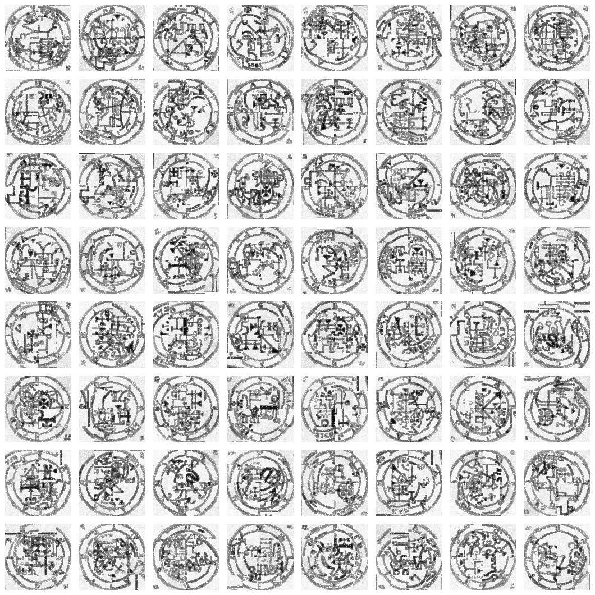

# NSRL — Integer-Only Neural Network Runtime

Pure Rust, `no_std`-compatible transformer training and inference with no
floating-point operations — not as a deployment optimization, but as the
training format itself.



*64 seals generated by an integer-only model — i8 weights, Q15 activations,
zero floating-point operations in training or sampling. It learned the visual
grammar of the* Key of Solomon *seal plates and samples new ones from a
seal-shaped prior. Reproduce with `scripts/run-solomon-seal-sample.sh`; see
[docs/solomon-seal-denoise.md](docs/solomon-seal-denoise.md).*

## What makes this different

Most "quantized" language models train in float32 and quantize afterward.
[BitNet b1.58](https://arxiv.org/abs/2402.17764) trains ternary weights from
scratch but still uses float Adam with float master weights internally.

NSRL has no float path at all. Weights are i8 from initialization. Activations
are Q15 i16 throughout. Gradients accumulate in i64 and quantize back to i8 at
each batch boundary. The same arithmetic contract used at inference is used
during every training step.

The practical consequence: the known problem where a single-step integer gradient
quantizes to zero is solved without floating-point master weights. Instead,
gradients accumulate across a configurable batch window in i64, then a single
averaged i8 update is applied when the batch boundary is reached.

## Architecture

```
Weights:          i8  (per-output-channel fixed-point scales)
Activations:      i16 Q15
Accumulators:     i32 (i64 for large reductions and gradient accumulation)
Residual stream:  i16 Q15 (static scale, no dynamic realignment across layers)
Attention:        native base-2 softmax (shift-and-LUT, no multiplication by log₂e)
RMSNorm:          integer block-floating — leading-zero count + LUT reciprocal sqrt
MLP gate:         piecewise Hard SiLU (power-of-two approximation, branchless)
```

The attention head dimension must be a power of four so that `√d_k` is an
exact arithmetic right shift. Head-dim validation is enforced at runtime.

## Performance

### Forward pass

4-block transformer, seq_len=128, d_model=128, 1M i8 weights, single CPU core
(Apple M4 Max, aarch64):

```
median: 49.6ms   min: 48.9ms   tokens/sec: 10,312
```

### Linear vs softmax attention

Single block, seq_len=128, zero allocation (pre-allocated workspaces):

| config        | softmax | full linear | incremental linear | prefix-rescan → incremental |
|---------------|---------|-------------|--------------------|-----------------------------|
| seq128 d=32   |  516µs  |  121µs      |  123µs             |  66.39×                     |
| seq128 d=128  | 1495µs  | 1425µs      | 1388µs             |  69.83×                     |
| seq512 d=32   | 6564µs  |  479µs      |  477µs             | 253.66×                     |

Linear attention scales O(n·d²) vs softmax O(n²·d). The gap widens at smaller
d_model and longer sequences. Linear attention streaming mode (incremental state
update) runs O(d²) per token regardless of context length.

### Vectorization

The linear kernel uses `i8 × i16 → i32` accumulation via `wrapping_add` behind
a range pre-check, which lets LLVM emit NEON SIMD automatically. The tile-4
output register pattern computes 4 output rows per input vector pass. An
explicit NEON intrinsics kernel exists but benchmarks ~13% slower than the
auto-vectorized path — LLVM's scheduler wins on the M4 Max.

## What is implemented

**nsrl-core** (`no_std`, no unsafe outside NEON module)
- Linear layer: i16×i8→i32→i16 with per-output-channel scales
- Causal self-attention: base-2 softmax, full linear, and incremental linear variants
- Streaming linear-attention state update for O(d^2) generation
- Gated MLP: Hard SiLU gate, up/gate/down projections, Q15 residual output
- RMSNorm: integer block-floating with LUT reciprocal sqrt
- Backward passes: linear, gated MLP, attention (softmax and linear paths)

**nsrl-corpus**
- Deterministic corpus builders for Shakespeare + SimpleWiki lanes
- SimpleWiki extraction and Gutenberg cleanup helpers
- Byte tokenization (`u8`) with identity and ASCII-lower profiles
- Lexeme tokenization (`u16`) with byte fallback, fixed-vocab replay, and
  frequency or balanced vocabulary profiles
- JSONL trace rows for corpus, byte-token, and lexeme-token contracts

**nsrl-train**
- Byte-level, lexeme, and mini-transformer training/generation modes
- Mini-transformer training: embedding + attention + gated MLP + output head
- i64 batch gradient accumulation across configurable window batches
- Residual carry across batch boundaries — sub-i8 gradient energy integrates
  across windows rather than being discarded; per-component carry for Q, K, V, O
- Ring-buffer rollback (8 checkpoints) — reverts on integer overflow
- Lexeme embedding pretraining with frequency-weighted quality filter
- Lexeme softmax training, continuation, held-out BPT evaluation, and generation
- Self-synthesis pipeline: train → generate synthetic corpus → retrain
- Corpus interleaving: round-robin chunk mixing of multiple text sources
- Decode controls: corpus priors, prompt-topic priors, memory priors, local
  frequency caps, strict adjacency/topic/memory modes, and reusable
  `coherent-prose` / `grounded-prose` decode profiles
- Mini-transformer attention modes: `base2-softmax`, `linear`, generation-only
  `linear-streaming`, and `linear-streaming-ttt`
- Prototype adaptive shift controllers for attention/MLP/output/embedding
  learning-rate shifts with traced rule events and holographic controller state

**nsrl-demo**
- Forward trace (`toy` preset): inspectable JSONL for the full block
- Benchmark (`bench-1m` preset): 1M-weight timing with deterministic output hash
- Linear attention microbenchmark: softmax vs linear side-by-side

## Running

```bash
# Build all release binaries
cargo build --release

# Forward trace (inspectable JSONL)
cargo run -p nsrl-demo -- --preset toy --input "hello"

# 1M-weight benchmark, 20 runs
cargo run --release -p nsrl-demo -- --preset bench-1m --warmup 3 --repeat 20

# Linear vs softmax attention benchmark
cargo run --release -p nsrl-demo --bin linear_attention_bench

# Full local checks: no-float guard, fmt, tests, clippy, diff whitespace
./scripts/check.sh
```

### Corpus and tokenization

```bash
# Build a deterministic Shakespeare + SimpleWiki corpus
bzip2 -dc data/raw/simplewiki-latest-pages-articles.xml.bz2 | \
  cargo run -p nsrl-corpus -- prepare \
    --shakespeare data/raw/shakespeare-gutenberg-100.txt \
    --simplewiki-xml - \
    --out data/processed/wiki-bard-corpus.txt \
    --trace data/processed/wiki-bard-corpus.trace.jsonl

# Byte-tokenize a corpus
cargo run -p nsrl-corpus -- tokenize \
  --corpus data/processed/wiki-bard-corpus.txt \
  --tokens-out data/processed/wiki-bard-corpus.tokens.u8 \
  --trace data/processed/wiki-bard-corpus.tokens.trace.jsonl \
  --seq-len 128 --stride 1

# Lexeme-tokenize with a balanced 4096-token vocabulary
cargo run -p nsrl-corpus -- lexeme-tokenize \
  --corpus data/processed/wiki-bard-corpus.txt \
  --tokens-out data/processed/wiki-bard-corpus.tokens.u16 \
  --vocab-out data/processed/wiki-bard-corpus.vocab.tsv \
  --trace data/processed/wiki-bard-corpus.lexeme.trace.jsonl \
  --seq-len 32 --stride 1 \
  --max-vocab 4096 \
  --lexeme-vocab-profile balanced \
  --lexeme-frequency-cap 4096
```

### Training and generation

```bash
# Train lexeme embeddings
cargo run --release -p nsrl-train -- \
  --mode lexeme-embedding \
  --tokens data/processed/wiki-bard-corpus.tokens.u16 \
  --vocab data/processed/wiki-bard-corpus.vocab.tsv \
  --model-out data/processed/wiki-bard-corpus.nsrllex \
  --trace data/processed/wiki-bard-corpus.embedding.trace.jsonl \
  --vocab-size 4096 --embedding-dim 16 \
  --context-radius 2 --max-windows 65536 \
  --quality-weight-profile cruft-aware

# Train or continue a lexeme softmax LM from embeddings or an existing .nsrllm
cargo run --release -p nsrl-train -- \
  --mode lexeme-softmax \
  --tokens data/processed/wiki-bard-corpus.tokens.u16 \
  --vocab data/processed/wiki-bard-corpus.vocab.tsv \
  --model data/processed/wiki-bard-corpus.nsrllex \
  --model-out data/processed/wiki-bard-corpus.nsrllm \
  --trace data/processed/wiki-bard-corpus.softmax.trace.jsonl \
  --seq-len 8 --batch-windows 8 --max-windows 131072 \
  --lr-shift 20 --max-lr-shift 22 \
  --quality-weight-profile cruft-aware

# Evaluate held-out bits per token without weight updates
cargo run --release -p nsrl-train -- \
  --mode lexeme-evaluate \
  --tokens data/processed/wiki-bard-corpus.tokens.u16 \
  --model data/processed/wiki-bard-corpus.nsrllm \
  --seq-len 8 --stride 1 --max-windows 10000

# Generate lexeme text with corpus, topic, and memory priors
cargo run --release -p nsrl-train -- \
  --mode lexeme-generate \
  --model data/processed/wiki-bard-corpus.nsrllm \
  --vocab data/processed/wiki-bard-corpus.vocab.tsv \
  --tokens data/processed/wiki-bard-corpus.tokens.u16 \
  --prompt "the earth is an ancient planet" \
  --max-new-tokens 180 \
  --decode-profile coherent-prose \
  --sample-seed 19 \
  --text-out data/processed/sample.txt \
  --trace data/processed/sample.trace.jsonl

# Train a mini-transformer on a byte token file
cargo run --release -p nsrl-train -- \
  --mode mini-transformer-mlp \
  --tokens data/processed/my-corpus.tokens.u8 \
  --model-out data/processed/my-model.nsrlmt \
  --seq-len 32 --batch-windows 2 --max-windows 4096

# Generate with softmax attention (default)
cargo run --release -p nsrl-train -- \
  --mode mini-transformer-generate \
  --model data/processed/my-model.nsrlmt \
  --prompt "to be" --max-new-tokens 200 \
  --decode sample --sample-seed 3 --top-k 8 \
  --no-repeat-ngram 3

# Generate with full linear attention (rescans the context window)
cargo run --release -p nsrl-train -- \
  --mode mini-transformer-generate \
  --model data/processed/my-model.nsrlmt \
  --mini-transformer-attention linear \
  --prompt "to be" --max-new-tokens 200 \
  --decode sample --sample-seed 3 --top-k 8 \
  --no-repeat-ngram 3

# Generate with streaming linear attention (persistent O(d²) state per token)
cargo run --release -p nsrl-train -- \
  --mode mini-transformer-generate \
  --model data/processed/my-model.nsrlmt \
  --mini-transformer-attention linear-streaming \
  --prompt "to be" --max-new-tokens 200 \
  --decode sample --sample-seed 3 --top-k 8 \
  --no-repeat-ngram 3

# Generate with streaming linear attention plus integer TTT-style state updates
cargo run --release -p nsrl-train -- \
  --mode mini-transformer-generate \
  --model data/processed/my-model.nsrlmt \
  --mini-transformer-attention linear-streaming-ttt \
  --mini-transformer-position nope \
  --mini-transformer-ttt-lr-shift 8 \
  --prompt "to be" --max-new-tokens 200 \
  --decode sample --sample-seed 3 --top-k 8 \
  --no-repeat-ngram 3
```

Longer scripted runs live under `scripts/`. The most useful current entry
points are:

- `scripts/run-visionary-lexeme-sweep.sh` — tokenize, train embeddings, train
  lexeme softmax models, and sample across small/medium/large sweeps.
- `scripts/run-balanced-prose-lexeme.sh` — build a source-balanced prose corpus
  and train a lexeme lane.
- `scripts/run-simplewiki-lexeme-generate.sh` — best-of-N SimpleWiki-style
  generation with coherent-prose controls.
- `scripts/run-source-grounded-lexeme.sh` — fixed-vocab source-prior generation.
- `scripts/run-simplewiki-topic-curriculum.sh` and
  `scripts/run-simplewiki-topic-paragraph.sh` — topic-specific curriculum and
  paragraph assembly experiments.

## Current model quality

Corpus and model work is organized as three sibling tracks: **Signal LLM** and
**CosyWorld LLM** (state-conditioned world models that map a `private_state` to
an `expected_output`) and **Crowley Bard** (an output-only Shakespeare × Blake ×
Crowley twitterbot voice). All three have trained tiny prototypes on disk; the
open gap is corpus scale, not the integer contract. See
[docs/current-results.md](docs/current-results.md) and
[docs/world-llm-corpus-plan.md](docs/world-llm-corpus-plan.md).

### Bits-per-token (BPT) baseline

Lexeme softmax model on the SimpleWiki expository corpus (4096-token vocabulary,
seq_len=4, stride=1, 10k evaluation windows):

| Model | Windows trained | Bits/token | vs. uniform |
|-------|:-:|:-:|:-:|
| Uniform random | — | 12.00 | baseline |
| NSRL lexeme-softmax | 64K | 11.47 | −0.53 |
| NSRL lexeme-softmax | 128K | 10.61 | **−1.39** |

BPT is computed as −mean(log₂ p_target) over evaluation windows, where
`p_target` is the Q15 probability the integer model assigns to the correct
next token. Evaluation runs with no weight updates.

Command:
```bash
cargo run --release -p nsrl-train -- \
  --mode lexeme-evaluate \
  --tokens data/processed/my-corpus.tokens.u16 \
  --model data/processed/my-model.nsrllm \
  --seq-len 4 --stride 1 --max-windows 10000
```

These are small-capacity models (d_model effectively ~16). A large float
model on the same data would reach 4–6 bits/token. The gap is the scaling
target, not the architecture — the integer constraint does not prevent learning;
capacity and training budget do.

### Generation quality

The mini-transformer trained on a balanced Shakespeare / Blake / Crowley /
synthetic-SimpleWiki corpus produces topic-coherent word-level text. Sample
from a 4096-token vocabulary expository model, top-8 sampling:

> *the earth is smaller groups started doing enough information without meaning
> power while being seen through various times less money build almost
> everything does mean software programs every sound sound comes out age group
> makes less nuclear forces began again place every natural need...*

Quality metrics on 220-token samples:
- Cruft tokens (URLs, dates, CSS hex): **0**
- Distinct words per sample: **165–174**
- Max single-word repetitions: **3–4**
- Recommended decode uses `--no-repeat-ngram 3` to block phrase loops without
  changing model weights.

Generation is not grammatical. The model is capacity-limited at d_model=16.
Linear attention training (backward pass implemented) and scaling are active work.

### Linear attention training

The linear attention backward (`linear_numerator_straight_through_denominator_constant`)
is implemented and trains successfully. At d=32, seq_len=32, 8192 windows:

- `final_accuracy_per_mille: 184` (18.4%) with zero rollbacks
- Attention weights moving: O dominant (125M L1), K/V active (1.8M each), Q emerging (145K)
- The Q/K/V gradient asymmetry is structural to causal linear attention: K and V
  gradients accumulate over future positions; Q gradient scales with ‖S‖ and is
  small until the associative memory has learned useful structure. This is the
  correct learning order — retrieve after store — exposed as a discrete curriculum
  by integer quantization rather than smoothed over by float Adam momentum.

## Where this sits in the literature

| System | Integer training | Integer inference | Float master weights | Architecture |
|--------|:---:|:---:|:---:|---|
| Standard QAT (Jacob 2017) | ✗ | ✓ | ✓ | CNN/BERT |
| I-BERT (2021) | ✗ | ✓ | ✓ | BERT |
| BitNet b1.58 (2024) | ✓ (ternary) | ✓ | **✓** | Transformer |
| PocketNN (2022) | ✓ | ✓ | ✗ | Tiny MLP only |
| **NSRL** | **✓** | **✓** | **✗** | Transformer + LM |

NSRL is the only system (to our knowledge) that trains a transformer-class
language model with no floating-point arithmetic at any stage, including
gradients.

The i64 batch gradient accumulation that makes this tractable — accumulate
signal across N windows before any weight update, avoiding per-step
quantize-to-zero — does not appear in the published literature.

## Workspace

```
crates/
  nsrl-core/       no_std integer inference runtime (no unsafe except NEON module)
  nsrl-corpus/     tokenizer and corpus pipeline tools
  nsrl-demo/       forward trace and benchmark binaries
  nsrl-train-core/ no_std integer training kernels (shared by the trainer)
  nsrl-train/      integer training framework and generation CLI
  nsrl-sched/      integer-only swarm scheduling kernel (library)
docs/
  schemas.md              JSONL trace contracts
  current-results.md      current claims, evidence, and next steps
  wiki-bard-corpus.md     corpus preparation notes and source queue
  research-synthesis.md   cross-project design synthesis
research/
  integer-training.md    prior work on integer-only training
  linear-attention.md    linear/subquadratic attention survey
  test-time-training.md  TTT / linear attention state duality
scripts/
  check.sh                         local validation gate
  run-*-lexeme.sh                  corpus, training, and generation workflows
```

## Open research directions

### Adaptive shift scheduling

The trainer now has prototype adaptive shift controllers behind
`--adaptive-rule-shifts`, `--adaptive-attention-shifts`, and
`--adaptive-holographic-shifts`. They observe training dynamics such as
rollback/rejection behavior and traced update statistics, then adjust output,
MLP, embedding, and attention learning-rate shifts during a run. The controller
state is itself integer and is emitted in the training trace.

The holographic controller uses lagged binding: it stores the current integer
state vector and binds it to the next batch's teacher signal, so memory learns
which shift adjustment tends to follow a prior state rather than merely echoing
the same-step rule. Rule signals still override memory; when the rule is
silent, recalled memory can make a conservative one-step adjustment.

This moves adaptive scheduling from a pure future idea into an experimental
lane, but it is not yet a solved policy. The remaining question is how to make
the controller stable across corpora and model scales rather than tuned to a
single sweep.

The underlying problem remains: the optimal shift for a component is not
constant over training. Early in training, when weights are near-random and
gradient signal is weak, a more aggressive lower shift is needed to cross the
i8 threshold at all. Later, when the model is near a local minimum, a
conservative higher shift prevents overshoot and rollback. The optimal shift
traces a curriculum, not a constant.

The deeper problem: shift sweeps assume the optimum is static and independent of
other components. In practice, the right MLP shift depends on what the attention
weights are doing, which depends on what the embeddings have learned. A static
sweep finds a fixed point of a coupled system that never actually reaches that
fixed point during training.

The current prototype treats the shift schedule as a second learning problem.
The shift values are themselves parameters being optimized, but their loss signal
is the training dynamics (rollback rate, weight delta L1, gradient saturation
count) rather than the primary task loss. A small meta-network, itself integer
and without float, can observe these signals and emit shift adjustments.
This is not hyperparameter optimization in the traditional sense; it is a
controller that reads the gradient statistics and steers the learning rate
schedule in real time.

The learned version is still speculative because the reward signal is the
load-bearing problem. Rollback reduction rewards excessive conservatism, delta
L1 rewards movement rather than quality, and held-out BPT is too delayed for
per-batch control. The runnable controller is therefore rule-based: raise shifts
on recent rollbacks or saturation, lower them on sustained zero-delta counts,
and trace whether this reduces sweeps while improving BPT or component movement.
The holographic controller should wait until rule-based scheduling proves useful
across longer runs and until linear-attention-style forgetting is available for
stale meta-experience.

See [research/adaptive-shift-control.md](research/adaptive-shift-control.md)
for the control analysis and success criteria.

## Key papers

- [BitNet b1.58](https://arxiv.org/abs/2402.17764) — closest published work;
  differs in using float Adam during training
- [PocketNN](https://arxiv.org/abs/2201.02863) — integer training+inference in
  C++; MLP-only, uses Direct Feedback Alignment
- [Transformers are RNNs](https://arxiv.org/abs/2006.16236) — linear attention
  via kernel feature maps; implemented in nsrl-core
- [Gated Linear Attention](https://arxiv.org/abs/2312.06635) — hardware-efficient
  GLA; integer-friendly gating is a planned extension
- [TTT with KV Binding is Secretly Linear Attention](https://arxiv.org/pdf/2602.21204) —
  shows incremental linear attention state update = test-time training; directly
  applicable to NSRL's streaming mode
